# README
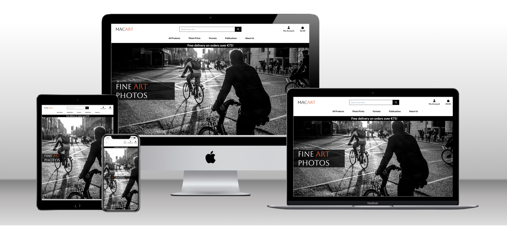

[**Live website](https://pp5-macart-6c87c04aa952.herokuapp.com/) | [GitHub Repository](https://github.com/zemaciel/MacArt)**

### Table of contents

- [Introduction](#introduction)
- [UX](#ux)
   * [Site Objectives](#site-objectives)
   * [B2C Focused](#b2c-focused)
   * [Target Demographic](#target-demographic)
   * [User Stories](#user-stories)
   * [Project Planning](#project-planning)
   * [Design Choices](#design-choices)
      + [Typography](#typography)
- [Marketing](#marketing)
- [Features](#features)
   * [Homepage](#homepage)
   * [Header and Navigation](#header-and-navigation)
      + [My Account](#my-account)
   * [FAQ](#faq)
   * [Contact Page](#contact-page)
   * [Registration/Authentication](#registrationauthentication)
   * [Products](#products)
   * [Product Detail](#product-detail)
   * [Shopping Bag](#shopping-bag)
   * [Checkout](#checkout)
   * [Artists](#artists)
   * [Artist Profile](#artist-profile)
   * [User Feedback](#user-feedback)
   * [Email Confirmations](#email-confirmations)
   * [Search](#search)
   * [Footer](#footer)
   * [Error Handling](#error-handling)
   * [CRUD (Create, Read, Update, Delete)](#crud-create-read-update-delete)
   * [Backend](#backend)
- [Technologies Used](#technologies-used)
- [Security and Authentication](#security-and-authentication)
- [**Validation and Testing**](#validation-and-testing)
- [**Bugs**](#bugs)
   * [**Existing Bugs**](#existing-bugs)
- [Future Enhancements](#future-enhancements)
- [Deployment](#deployment)
- [Credits](#credits)
   * [Code](#code)
   * [Image Sources](#image-sources)
   * [Other](#other)
   * [Acknowledgements](#acknowledgements)


# Introduction

**MacArt Fine Art Photo Prints** is the Minimum Viable Product (MVP) for a B2C e-commerce website. It represents the fifth and final project of the Code Institute diploma in Full Stack Software Development.

[**Live website](https://pp5-macart-6c87c04aa952.herokuapp.com/) | [GitHub Repository](https://github.com/zemaciel/MacArt)**

**MacArt Fine Art Photo Prints** is a fictional e-commerce project crafted with Django, Python, JavaScript, and Bootstrap 4. The website is hosted on Heroku, utilises Amazon S3 for cloud storage, and incorporates Stripe for payment gateways. It acts as an online marketplace for a fine art photography gallery, primarily vending prints alongside publications that showcase their artists' work.

The website incorporates role-based permissions, allowing varied user interactions with a core dataset. It also boasts user authentication, email validation, and comprehensive CRUD (Create, Read, Update, Delete) functionalities.

> Caution: The payment system relies on Stripe. Bear in mind that this site is designed solely for educational objectives. Avoid inputting real credit/debit card details.
> 
> 
> For testing, consider using a Stripe test card number like `4242 4242 4242 4242`, a future expiry date, e.g., `04/24`, and any three-digit CVC.
> 

---

# UX

## Site Objectives

The primary objective is to give users a simple, seamless shopping experience while putting artists and their masterpieces in the limelight.

## B2C Focused

At its core, the application predominantly is focused on business-to-consumer demands. 

## Target Demographic

The ideal user for **MacArt Fine Art Photo Prints** spans all age brackets but shares a common interest: a penchant for top-notch photographic prints. Whether it's to adorn their living space, spruce up their workspace, or as a thoughtful gift, our prints cater to their artistic inclinations.

## User Stories

For more details of user stories pertinent to this project, please refer to [this link](https://github.com/zemaciel/MacArt/issues).

**Users will:**

- Browse, get details, and effectuate purchases swiftly and easily.
- Encounter a responsive design, ensuring a seamless experience across all gadgets.
- Register an account, update profile details, and retrieve their password should they forget it.

**Users anticipate:**

- A user-friendly e-commerce portal with a hassle-free purchasing process.
- A visually pleasing website regardless of the device.
- A website with good performance and minimal glitches.

## Project Planning

User stories were categorised into 'Must Have', 'Should Have', 'Could Have', and 'Won't Have' to ensure a strategic implementation approach. The project was orchestrated using GitHub Projects and adhered to an Agile methodology. You can view the project's Kanban Board [here](https://github.com/users/zemaciel/projects/3).

## Design Choices

Given that the primary offerings are fine art photographs, the website's design aims to be unobtrusive, ensuring the art remains the focal point. The colour palette predominantly revolves around white, black, and varying shades of grey. However, occasional bright orange details are interspersed, both to maintain brand consistency and to inject a touch of creativity.

### Typography

- **Aboreto-Regular** was selected for the logo, price tags, and most headings. This font combines the contemporary appeal of a sans-serif with the graceful curves reminiscent of an elegant serif typeface.
- **Barlow** is the designated font for body text, menus, and other miscellaneous sections, providing readability while complementing the design aesthetics.
    
    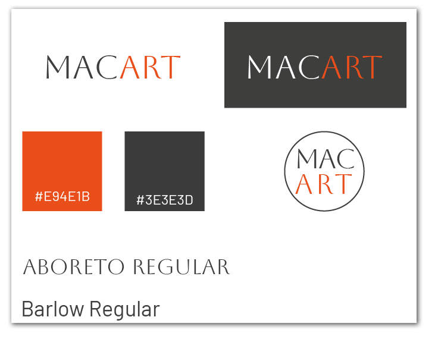
    

# Marketing

**MacArt Fine Art Photo Prints** hinges its marketing strategy on three pivotal pillars:

1. **Social Media Presence**: In a realm underpinned by photography, a robust social media presence is non-negotiable. Presented below is a mock-up of our envisioned Facebook page.


<details>
  <summary>Facebook Mockup</summary>

  

</details>
<br>
    
2. **Email Marketing**: Enthusiasts can subscribe to our newsletter, orchestrated via MailChimp, by completing the form situated in the website's footer section.
3. **SEO**: Comprehensive keyword research, spearheaded using platforms such as [Wordtracker.com](http://wordtracker.com/), yielded a robust set of search terms to augment our SEO footprint:
    - fine art photos, street photography, architectural photography, landscape photography, prints, wall art, home decor, interior decoration, photographers, and artists.
    Dedicated efforts have been made to weave these key terms seamlessly into the website's metadata, headers, and product narratives, thereby bolstering search engine prominence.
    
    Supplementing our SEO efforts, [AnswerThePublic.com](http://answerthepublic.com/) serves as an invaluable tool. It offers insights into commonly posed queries on the web, pivoting around specific keywords. For instance, a prevalent question, "What is fine art photography?" finds its comprehensive response right on our site's landing page.
    

<details>
  <summary>Answer the public</summary>

  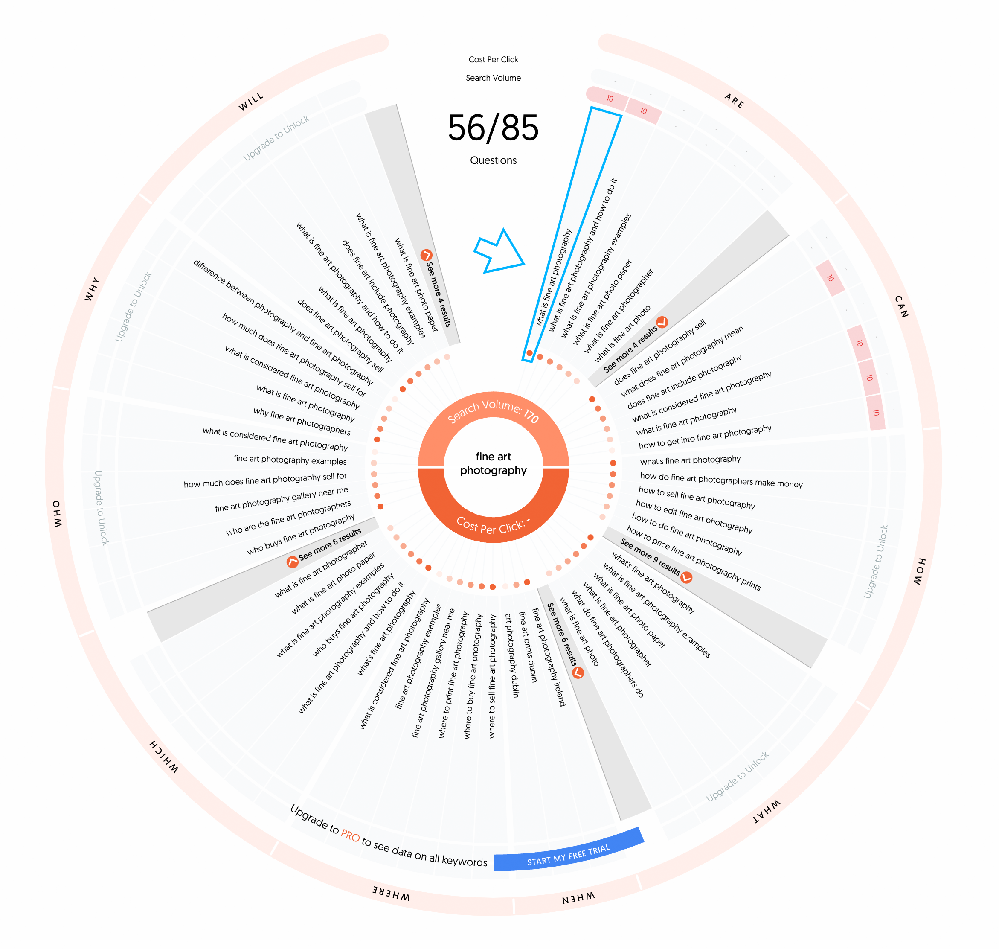

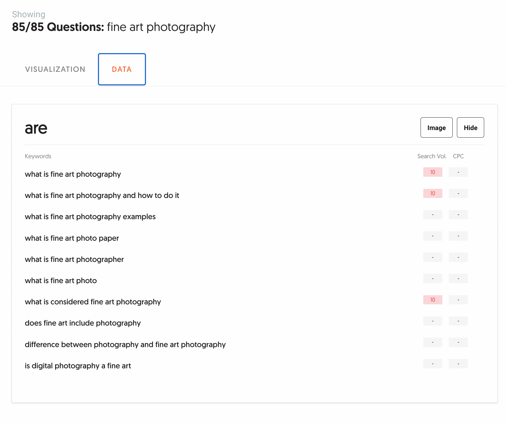

</details>

<br>
<br>

# Features

## Homepage

The primary point of entry for visitors, the homepage sets the tone for MacArt's brand followed by a brief introduction and an invitation to browse the gallery.

At the bottom of the page, there are logos of associations to which the artists could be contributors.   

This section is accessible from the menu About Us. 

 
<details>
  <summary>Home Page</summary>

  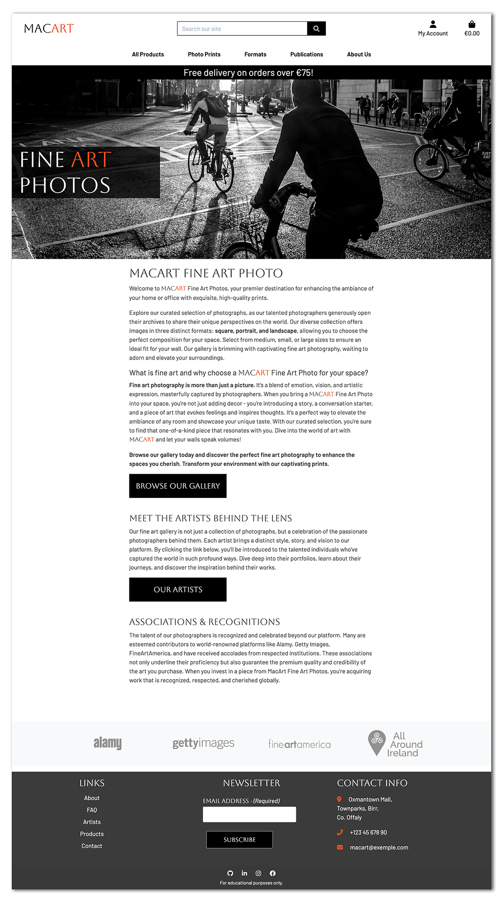

</details>
<br>


## Header and Navigation

- Logo
- Free Delivery Banner
- Search bar
- My Account
- Product and site navigation
- Shopping Bag
    
 <details>
  <summary>Header</summary>

  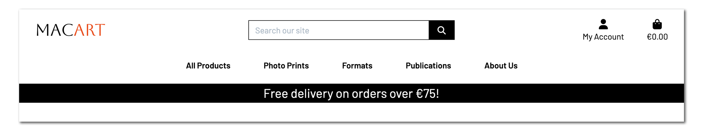

</details>
<br>
    
    

### My Account

Accessible to all users, with exclusive content for logged-in members. Features include:

- Registration/Login/Logout options
- Profile link for logged-in users
- Product Management and Artist Management for admin users

    
    
 <details>
  <summary>My Account</summary>

  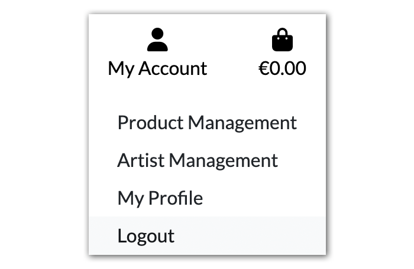

</details>
<br>

## FAQ

- Answers to common questions to assist users and boost SEO.
- Admin capability to add, edit, or delete entries.
- Display the date of the last update.

 <details>
  <summary>FAQ Page</summary>

  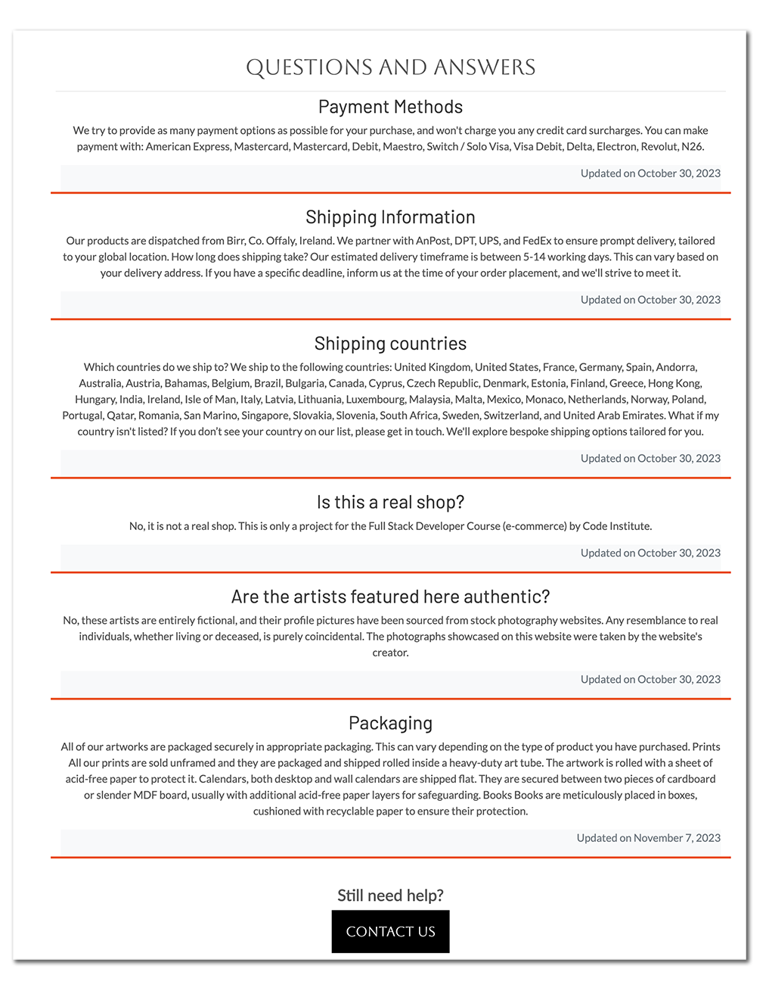

</details>
<br>


When an admin user is logged in, there's a button at the top of the page to add new entries and, under each entry, there are links to edit or delete the entries. 

 <details>
  <summary>FAQ Add a New Entry</summary>

  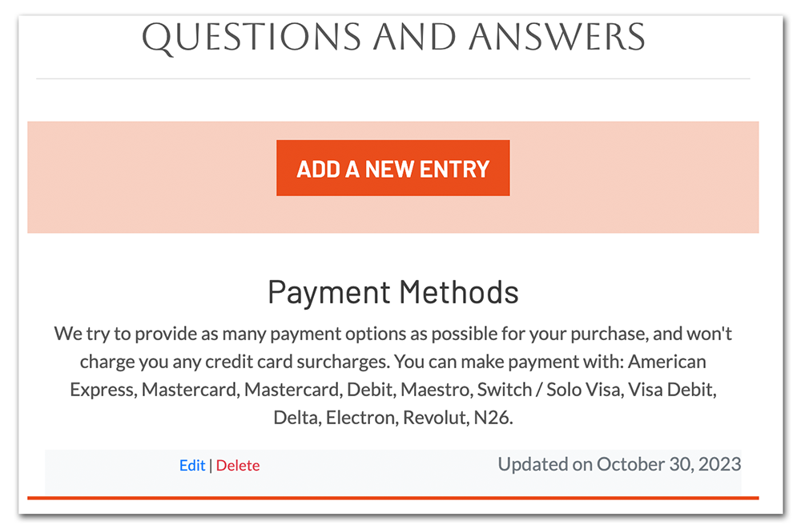


</details>

 <details>
  <summary>FAQ Management</summary>

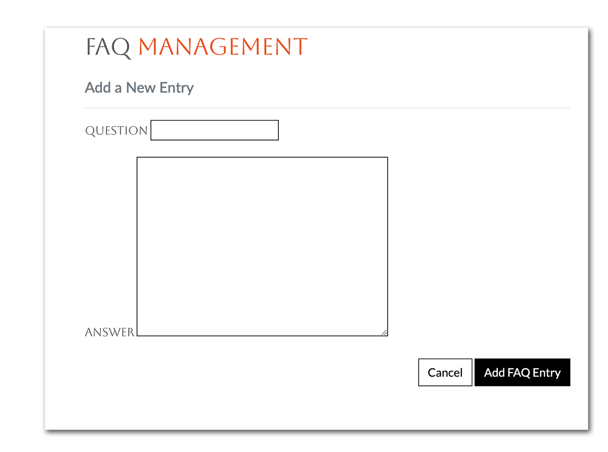

</details>
<br>


## Contact Page

- Contact page with contact information, map with localisation and a contact form.
    
- Contact form where the user can send an message to the site and see a confirmation on the screen after the message was sent.

 <details>
  <summary>Contact Page and Form</summary>

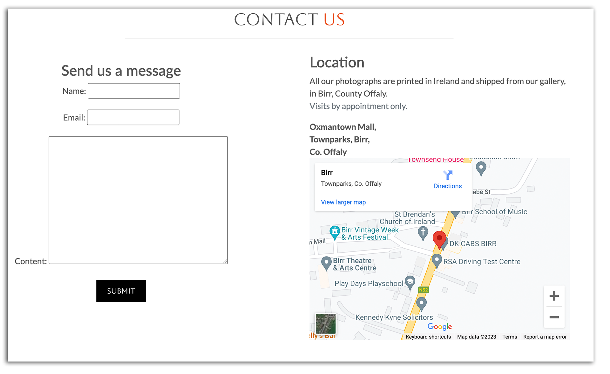
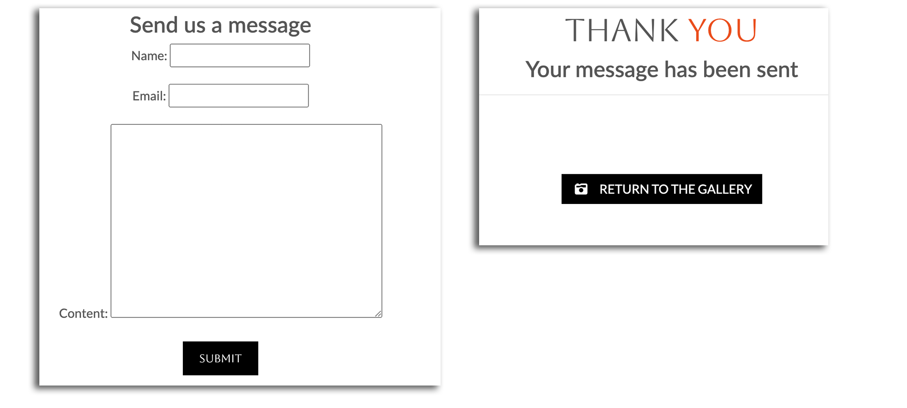

</details>
<br>
    


    

## Registration/Authentication

 <details>
  <summary>Users can create an account, sign in, and sign out.</summary>

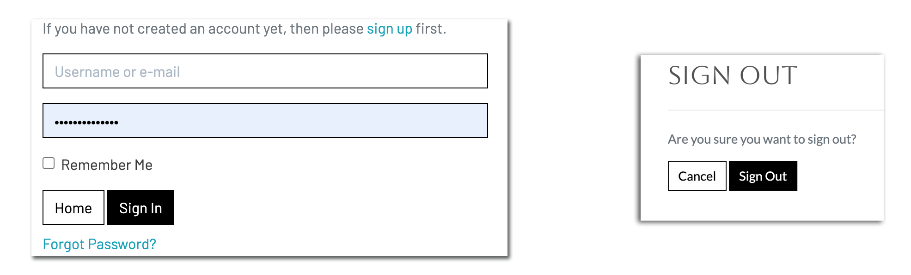


</details>
<br>
    
<details>
  <summary>Registration triggers a confirmation email.</summary>

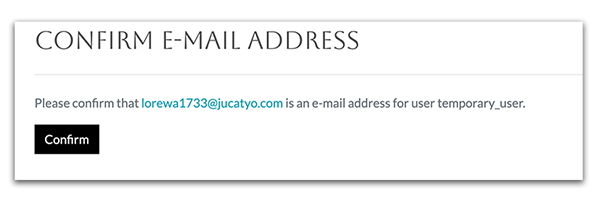


</details>
<br>
    
    
<details>
  <summary>Password recovery is available for registered users.</summary>


</details>
<br>
    
Logged-in users can update shipping info and view past purchases.

<br>

## Products

- Displays MacArt product listings with sorting and filtering.
- Products can be added to the cart or viewed in detail.
- Admin users have edit and delete options.


<details>
  <summary>Products and Product Management</summary>

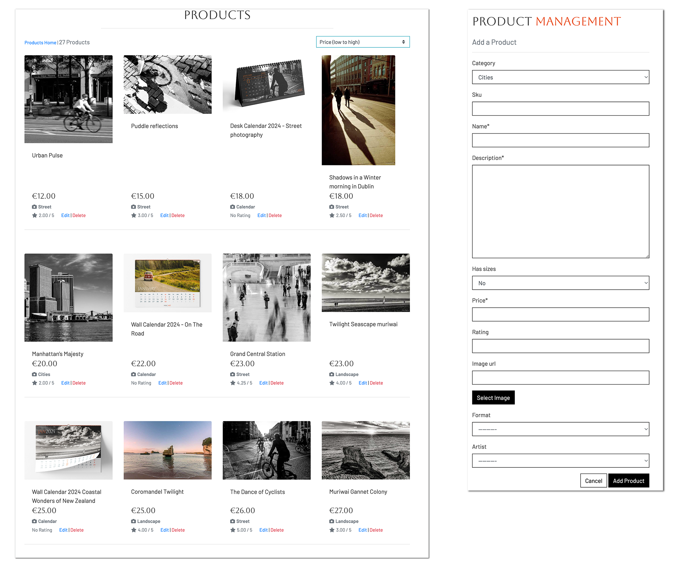


</details>
<br>

## Product Detail

Highlights include:

- Product information, including name, description, rating, and price.
- Size options and a size guide link to a collapsable panel with a size table.
- Artist attribution and link to their profile.
- Admin-specific edit and delete options.
    
   
    
<details>
  <summary>Product Details</summary>

 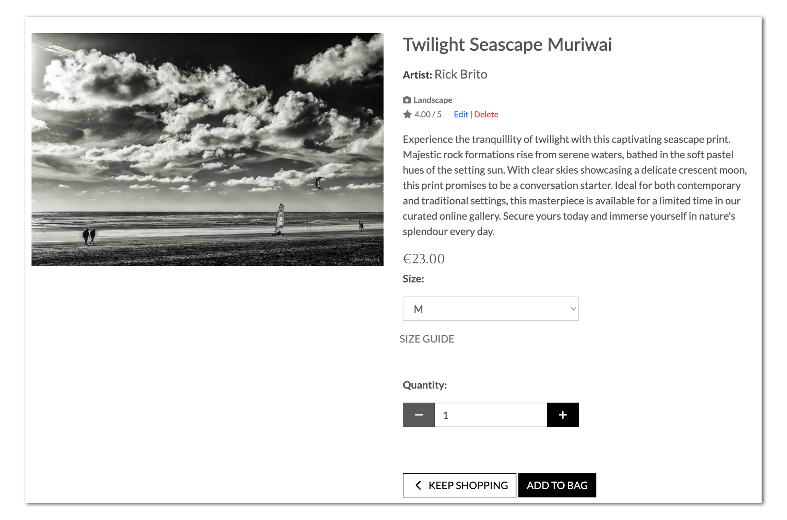


</details>
<br>


## Shopping Bag

- Users can add products for purchase.
- Notifications show product addition and cart total.
- Allows quantity adjustments and item removal.
- Directs users to secure checkout.
    
    
    
<details>
  <summary>Shopping Bag </summary>

 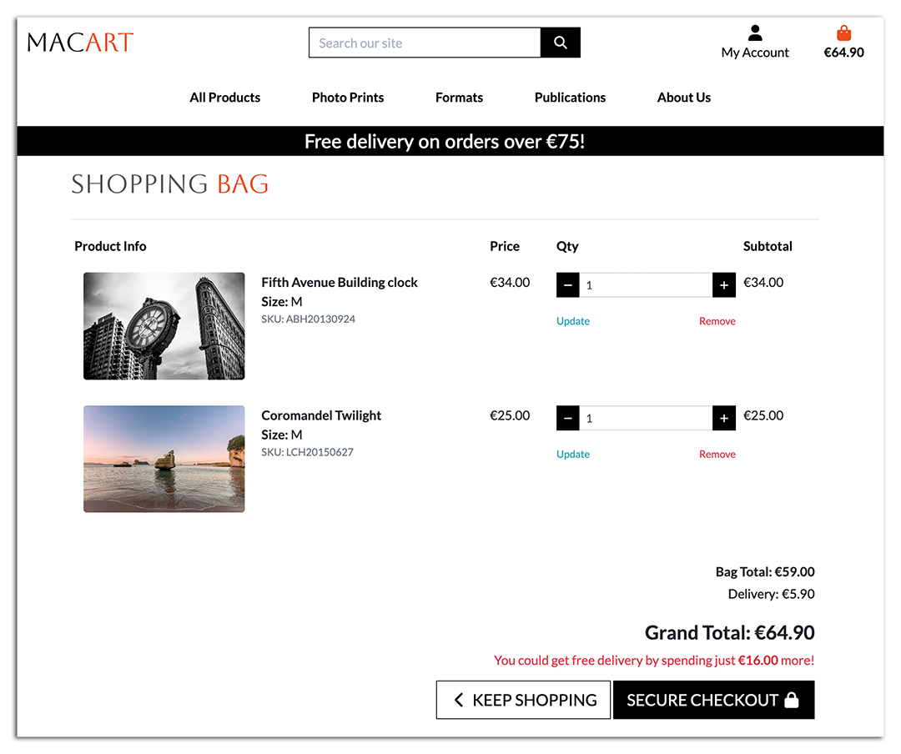


</details>
<br>


## Checkout

Finalises purchases by:

- Collecting shipping and payment details securely via Stripe.
- Offering profile updates with shipping details for returning users.
- The user will receive an email confirming the order.
    

<details>
  <summary>Check Out Page</summary>

 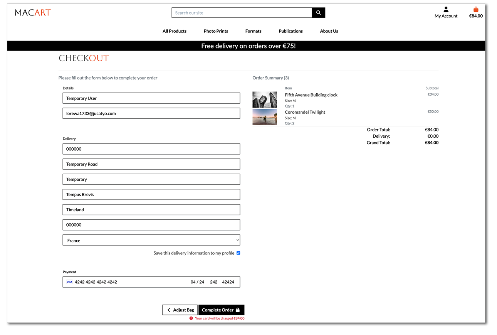


</details>
<br>
    

## Artists

- A page containing a list of artists, the user is directed to a page displaying the artist's profile, links to their social media and external website, and all their artworks existing on the site.
    
    
<details>
  <summary>Artists Page</summary>

 

</details>
<br>

## Artist Profile

- Contains a biography of the artist and links to their social media and external site.
- Lists the artist's works existing at MacArt's site
- Product pages link back to the artist's profile.
- A site admin can add a new artist in the Artist Management page.
- To edit or remove an artist, the site admin needs to access the Django Project admin section.
    
    
    
<details>
  <summary>Artists Profile Page</summary>

 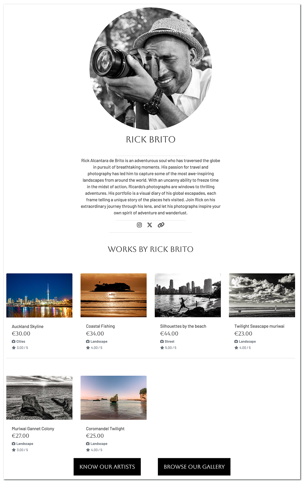

</details>
<br>

## User Feedback

Interactive messages provide feedback on user actions and can be closed by users.


<details>
  <summary>Exemple of feedback message</summary>

 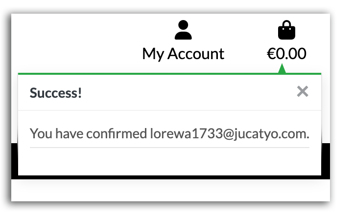

</details>
<br>


## Email Confirmations
   
<details>
    <summary>New registrations receive a verification email.</summary>

 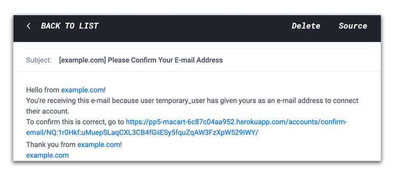

</details>

<details>
    <summary>Purchases trigger a detailed order confirmation email.</summary>

 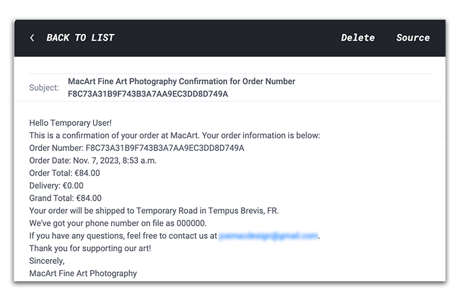

</details>
<br>


## Search

Located in the navigation bar, this feature scans product titles, descriptions, categories, and for user queries.

<details>
    <summary>Exemple of a search</summary>

 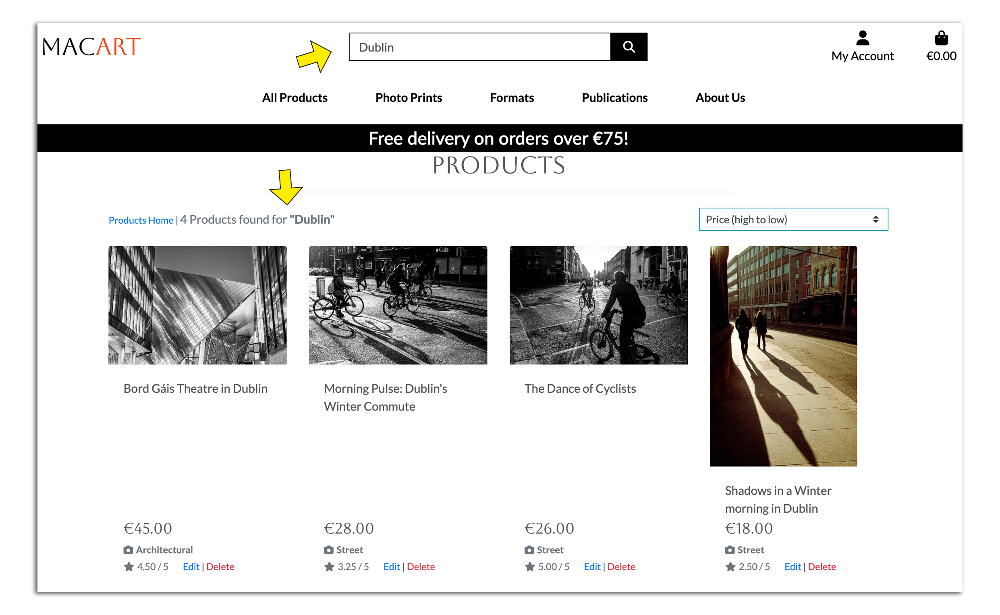

</details>
<br>


## Footer

Links to key site sections, a newsletter subscription form, and contact details.
<details>
    <summary>Footer</summary>

 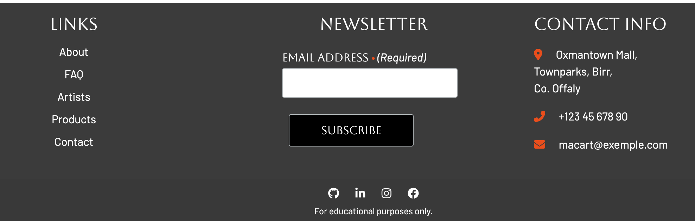

</details>
<br>


## Error Handling

The site is equipped with handlers for 403, 404, and 500 errors


<details>
    <summary>Error Handler</summary>

 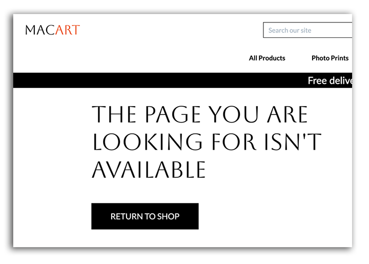

</details>
<br>


## CRUD (Create, Read, Update, Delete)

Admins can manage products and FAQs directly from the site.

## Backend

This project includes an administration area used by website administrators or staff members who can manage the products, categories, formsts artists, and FAQ entries.

<details>
    <summary>Django Administration</summary>

 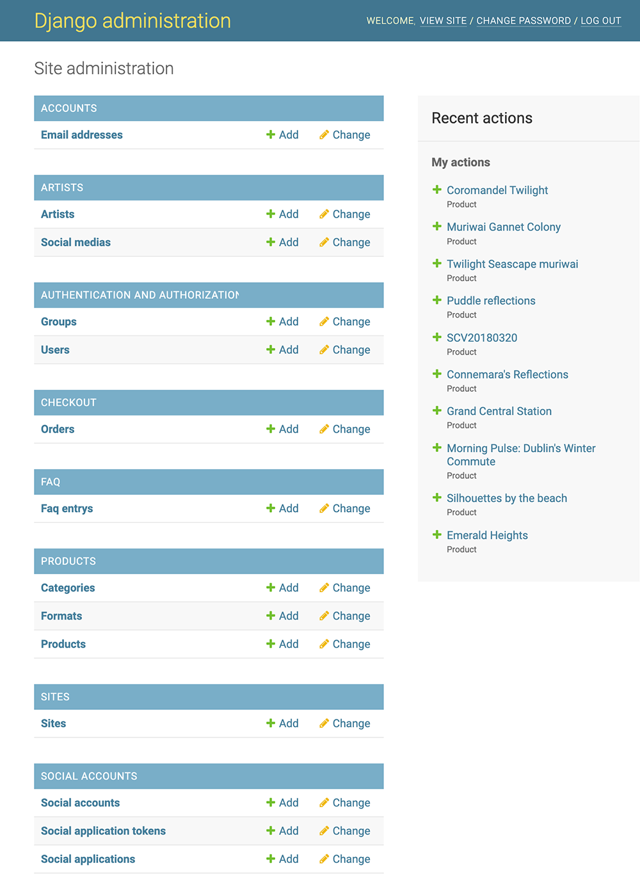

</details>
<br>


# Technologies Used

- [Django](https://www.djangoproject.com/) - A  Python web framework.
- [Bootstrap](https://getbootstrap.com/) - Open-source framework used for front-end development.
- [HTML5](https://en.wikipedia.org/wiki/HTML) - A markup language that describes the structure of the web page.
- [CSS3](https://en.wikipedia.org/wiki/CSS) - Provides the styling for the website.
- [JavaScript](https://en.wikipedia.org/wiki/JavaScript) - Provides interactive elements of the website
- [Python](https://en.wikipedia.org/wiki/Python_(programming_language)) - An interpreted, object-oriented language with dynamic semantics.
- [Gitpod](https://gitpod.io/) - Used to create and edit the website.
- [GitHub](https://github.com/) - Used to host the repository.
- [Google Chrome DevTools](https://developer.chrome.com/docs/devtools/) - Used to test the responsiveness of web pages and debug.
- [Google Fonts](https://fonts.google.com) - For the fonts used in this project.
- [Heroku](https://dashboard.heroku.com/) - Used to deploy the website.
- [PEP8 Validation](http://pep8online.com/) - Used to validate Python code.
- [HTML Validation](https://validator.w3.org/) - Used to validate HTML code.
- [CSS Validation](https://jigsaw.w3.org/css-validator/) - Used to validate CSS code.
- [JSHint Validation](https://jshint.com/) - Used to validate JavaScript code.
- [Mailchimp](https://github.com/andyk8872/p5-ecommerce/blob/main/mailchimp.com) - A mail service email marketing and automation service.
<br>
<br>
# Security and Authentication

A series of measures have been implemented to safeguard user data and maintain the integrity of the website. These measures include:

- The utilisation of an **`env.py`** file for the secure storage of crucial variables required to access protected services, such as the PostgreSQL Database.
- Incorporation of a **`.gitignore`** file to exclude the **`env.py`** file from being committed to the production codebase, thus maintaining the confidentiality of sensitive information.
- Storage of these essential variables in the Configuration Variables of Heroku, facilitating secure synchronization between GitPod and Heroku.
- Enforcement of Cross-Site Request Forgery (CSRF) tokens across all HTML forms, bolstering the website's defences against unauthorised commands that could be transmitted from a user's browser while they are authenticated.
- Integration of Django’s built-in user authentication system for critical areas of the site, ensuring that only verified users can post reviews. Additionally, administrative privileges are required to manage product listings (Create, Update, Delete) on the front end, further securing these operations to users with 'Admin' status.
<br>
<br>
# **Validation and Testing**

I have chosen to include a series of manual tests, with the possibility of adding unit tests if time permits.

- Each user story will be tested.
- **Browser Testing** - Pages were manually tested on Google Chrome for both desktop and mobile. The site was also tested on Firefox and Safari for desktop.
- **Code Validation** - Validation tools were utilized to check the HTML, CSS, and Python.

For more details about testing, please refer to the [**Testing.md**](readme/Testing.md).
<br>
<br>
# **Bugs**

Most of the bugs that caused problems or errors were the result of typos and code lines copied and pasted from one part of the site to another without proper updates. These were eventually fixed.

Other bugs emerged when trying to implement ideas that seemed straightforward but proved more complex than anticipated. For instance, while adding a feature to select "paper finishing", which was supposed to resemble the "select size" feature, I had to abandon that route. Additionally, the feature to edit artists using the site's AI was not functioning as intended.

For some other problems, the solutions were found by researching online and checking similar projects for other students. 

The email confirming a purchase wasn't being sent to users. After researching Slack, I pinpointed the likely source of the error in the **`webhook_handler`** code. I compared my code with others from different projects. The primary changes were in these two lines:

```python
pythonCopy code
billing_details = intent.charges.data[0].billing_details
grand_total = round(intent.charges.data[0].amount / 100, 2)

```

The revised version is:

```python
pythonCopy code
billing_details = stripe_charge.billing_details
grand_total = round(stripe_charge.amount / 100, 2)
```

But as the saying goes, "haste makes waste." With the approaching deadline to deliver the project, I ended up speeding up the deployment of this project, which wasn't as seamless as my previous ones. Even though they were very similar, I encountered errors during the AWS account setup and database migration. Thankfully, with the assistance of the Code Institute Tutors, and after revisiting many of the steps, I successfully deployed the site.

## **Existing Bugs**

Regrettably, not all issues were addressed due to time constraints and concerns about potentially introducing larger issues. 

- **Artist Profile:** Initially, I established artist profiles using two separate models—one for the artist's personal profile and another for their social media links. Upon reflection, this separation was unwarranted; ideally, both components should have been consolidated into a single model. Within the site's admin section, the functionality performs correctly, permitting an admin to add, edit, and delete artists.
However, issues arise when utilizing the "Artist Management" user interface. While adding a new artist is seamless, attempts to edit an artist profile trigger an error, preventing any changes from being saved. Although this feature is not critical for the current project iteration, its full functionality would be advantageous. Due to time constraints and the complexities of revising the app's view and model codes, the editing and deleting were removed from the user interface.
- **Font Display on Safari 16.1**: The font "Barlow" wasn't rendering and was replaced by a serif font. Meanwhile, the logo font, "Aboreto", displayed correctly.
- **Newsletter Subscription Redirect**: Post-subscription to the newsletter via the MailChimp form, users are navigated to a "Subscription Confirmed" page with two buttons: "Continue to our website" and "Manage your preferences". Clicking on "Continue to our website" should ideally redirect users back to the MacArt page. Instead, they encounter an empty MailChimp form soliciting further details (email, name, and date of birth), accompanied by a notification of underlying errors.
- **PEP 8 Linter:**  Some Python files “contained line too long” errors that I chose not to rectify presently, especially considering their critical nature and the fact that these errors don't compromise the site's performance.
    - **mac_art (project)**: settings
    - **Checkout App**: views, webhooks
    - **Products App**: widgets
    - **Profile**: forms

# Future Enhancements

There's always room for improvement. However, due to time constraints, some enhancements were left for future iterations. Here are a few of them:

- **Confirmation before deleting:** For the admin users when using the sections to manage Artists, Products and FAQ Entries, when the click delete the item is deleted straight away. There might be a good idea to first show a confirmation page or modal to the user before the actual deletion.
- **Product Ratings**: Presently, the rating feature is merely a placeholder. The ratings showcased are arbitrary values assigned by the site administrator. A genuine rating system, based on customer feedback, would be better.
- **Dynamic Pricing**: Currently, while users can select print sizes, this choice doesn’t impact the product's price. Realistically, different sizes should correspond to different price points to reflect the tangible costs associated with production.
- **Paper Finish Options**: Enabling users to choose the type of paper finish—be it glossy or matte—can greatly enhance the personalised shopping experience.
- **Filter by Format**: After reviewing the user experience, a dual-layered product filtering system, where users could first choose photos by theme and subsequently filter their choices by format, would be a nice feature.
- **Image Lightbox**: Rather than redirecting to a new browser tab when users click on a product image, a more elegant solution would be the integration of a [Lightbox](https://www.w3schools.com/howto/howto_js_lightbox.asp). This feature would present an enlarged image overlay within the same browser window, elevating the overall user experience.

# Deployment

The project has been deployed to Heroku. A detailed step-by-step guide to deploy the project can be found in the link below:

[**Deployment**](readme/Deployment.md)

# Credits

## Code

This project was heavily based on the [Code Institute Walkthrough Project Boutique Ado](https://github.com/Code-Institute-Solutions/boutique_ado_v1)

Other sources: 

- Django [Field tag label class](https://stackoverflow.com/questions/13187129/django-field-tag-label-class)
- Django [Contact Form](https://www.youtube.com/watch?v=dnhEnF7_RyM)
- save(commit=False): [StackOverFlow](https://stackoverflow.com/questions/12848605/django-modelform-what-is-savecommit-false-used-for), [itecnote](https://itecnote.com/tecnote/r-django-modelform-what-is-savecommitfalse-used-for/)
- Footer based on [Art of Tea](https://github.com/irinatu17/Art-of-Tea/blob/master/templates/includes/footer.html) project
- Error handlers from the [Black and White Beauty](https://github.com/rachel-o-donnell/black_and_white_beauty/tree/main) project
- [Embedding Google Maps](https://www.youtube.com/watch?v=ObYgwokpOuI)
- [Bootstrap Collapse Panel](https://getbootstrap.com/docs/4.0/components/collapse/)
- [Favicon](https://favicon.io/favicon-converter/)
- Webhook Handler - code compared with the projects [Retro-Football-Kits](https://github.com/gareth-39/Retro-football-kits/blob/main/checkout/webhook_handler.py) and [Bookworks](https://github.com/MoniMurray/bookworms-et-al/blob/main/checkout/webhook_handler.py)

## Image Sources

- The showcased photographs are sourced from the project author's personal collection.
- Product mock-ups, particularly for books and calendars, have been obtained from [mockups-design.com](https://www.mockups-design.com/).
- Mockups with screenshots of the site in different devices: [https://techsini.com/multi-mockup/index.php](https://techsini.com/multi-mockup/index.php) with [https://chrome.google.com/webstore/detail/ignore-x-frame-headers/gleekbfjekiniecknbkamfmkohkpodhe](https://chrome.google.com/webstore/detail/ignore-x-frame-headers/gleekbfjekiniecknbkamfmkohkpodhe)
- Artist profile images have been licensed from Adobe Stock.
- Logos pertaining to Alamy, GettyImages, and FineArtAmerica have been sourced directly from their respective official websites. It's imperative to note that this project is purely educational and does not signify any official association or endorsement from the aforementioned entities. They've been incorporated as exemplary representations of reputable platforms an art gallery might associate within a real-world context.

## Other

- Deployment instructions from Andrew Kennedy's [project 5](https://github.com/andyk8872/p5-ecommerce/).
- The text for the product descriptions, intro to the website and artist profiles were partially generated with AI tools such as [Google Bard](https://bard.google.com/) and [ChatGTP](https://openai.com/).
- PEP 8 - [Style Guide for Python Code](https://peps.python.org/pep-0008/#maximum-line-length)
- Sitemap: [https://www.xml-sitemaps.com/](https://www.xml-sitemaps.com/)
- Temporary email: [https://temp-mail.org/en/](https://temp-mail.org/en/)

## Acknowledgements

This project is part of the Full Stack Development course from Code Institute. I would like to thank the Code Institute team, including my mentor, the toutor and the student supports that always helped when I needed. Also the Code Institute slack community.
