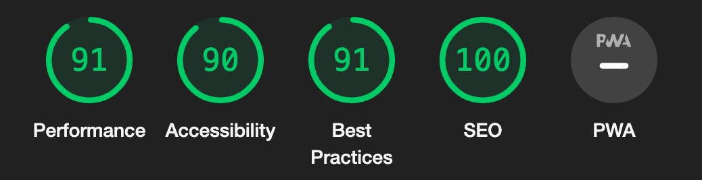
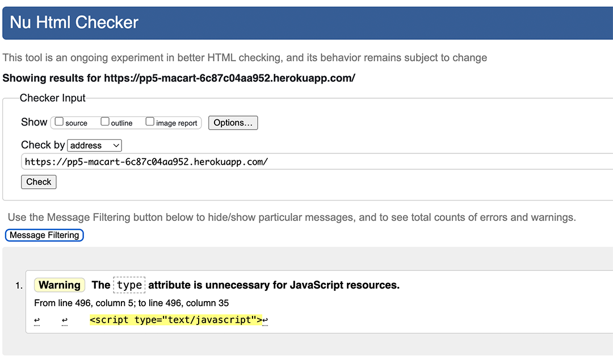
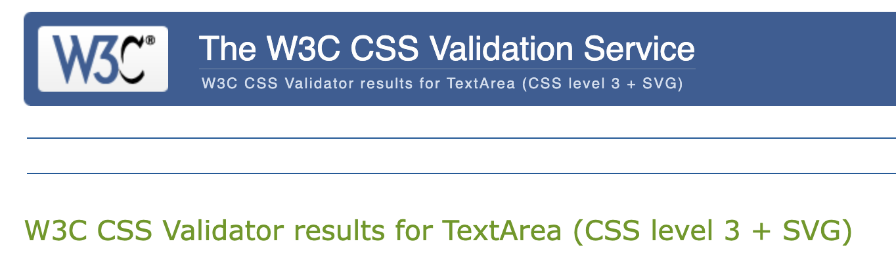

# Testing

### Table of contents

The website was tested using various methods to ensure functionality, performance, and compliance with standards.

# **Lighthouse in Google DevTools**:

- All pages underwent performance analysis using Google DevTools' Lighthouse. The scores were consistent across the website.
    
    
    
- On mobile devices, performance scores were slightly lower but remained within acceptable ranges, not indicating any critical issues.
    
    
    

# **HTML Validation**:

- The site's HTML was validated using the [W3C Markup Validation Service (ValidatorW3)](https://validator.w3.org/). Initial checks revealed minor issues related to `aria-labelledby` attributes, `id` attributes, and other small concerns.
- These issues were addressed and rectified, leading to a validation result free of errors. There are residual warnings that, upon review, do not affect site functionality and, as such, have not been modified.
    
    
    

# **CSS Validation**:

- The CSS was validated with the [W3C CSS Validation Service (Jigsaw)](https://jigsaw.w3.org/css-validator/), showing no errors.
    
    
    
- A few non-critical warnings were identified but deemed not impactful to the site's presentation or performance and were left unaltered.
    
    
    

# **PEP8 Compliance**:

- Python code was checked for PEP8 compliance using the [CI Python Linter.](https://pep8ci.herokuapp.com/) This identified several issues, mostly related to line length and whitespace usage.
- While the majority of these issues were addressed, a few remain in critical files. Adjusting these lines posed a risk of introducing new bugs or unwanted behaviour, which would require additional time to resolve. Therefore, these few long lines were left as is and are documented in the 'Bugs' section of this README file.

# User Story Testing

| User Story | Expected Behaviour | Steps to Test | Actual Behaviour | Status |
| --- | --- | --- | --- | --- |
| As a user, I can see the frequently asked questions so that I can browse for answers to similar queries I may have. | FAQ section should be visible and provide answers to common questions. | Navigate to the FAQ page and review questions and answers. | FAQ section is present and contains comprehensive answers. | Pass |
| As a user, I can contact the shop so that I can have my queries answered. | A contact form should be available for user inquiries. | Go to the 'Contact us' page, fill out, and submit the contact form. | Contact form submission is successful and user receives confirmation message on the screen. | Pass |
| As a user, I can subscribe to the shop's newsletter so that I can get updates about the artists and new products. | Subscription option should be available and user should be able to subscribe. | Locate subscription form in the footer, enter details, and subscribe. | The subscription is successful, and the user gets a confirmation email. | Pass |
| As a user, I can browse photographs and other products so that I can select which one to order. | Products should be displayed for users to view and select. | Navigate to the 'Products' page and view the items. | All products are displayed and selectable. | Pass |
| As a user, I can browse the photos by theme (street photography, landscape, architectural, etc.) so that I can narrow my search. | Filtering by theme should refine the product listings. | Select a theme filter and observe the filtered results. | Products are correctly filtered by the selected theme. | Pass |
| As a user, I can browse by format so that I can choose images that would fit a specific space. | Format options should be available for users to filter products. | Choose a format filter and observe the changes. | Products are correctly filtered by the selected format. | Pass |
| As a shop admin, I can add, remove, and edit products directly in the interface so that my edits can be done easier and faster than going to the site admin area. | Admin should be able to manage products via the interface. | Log in as admin, navigate to product management, and perform CRUD operations. | Product management is functional with all features working as expected. | Pass |
| As a user, I can sort the list of available products so that the products are displayed ordered by price. | Sorting functionality should be available on the product listing page. | On the 'Products' page, use the sort option to order by price. | Products are sorted by price correctly. | Pass |
| As a user, I can search for a product by name or description so that I can find a specific product I would like to purchase. | The search feature should return results based on inputted terms. | Use the search bar to find a product by name or description. | Search returns accurate results related to the query. | Pass |
| As a user, I can see what search query I inputted and the number of results so that I can quickly decide whether the product I want is available. | The search results should reflect the user's query and show the number of matches. | Perform a search and review the results and search terms displayed. | The search terms and the number of results are clearly displayed. | Pass |
| As a user, I can see who is the author of each photograph so that I can get to know more about the artist. | The artist's name should be linked with each photograph. | View a product and check for the artist's attribution. | Artist's name is displayed under the title of their work. | Pass |
| As a user, I can find a biography of the artists so that I can get to know their history and achievements. | Biographies should be present in the artist's profile pages. | Visit an artist's profile to read their biography. | Biographies are available and provide insight into the artists. | Pass |
| As a user, I can see a gallery of works by one specific artist so that I can browse their work if I like the style. | A gallery for individual artists should be available on the artist's profile pages. | Visit an artist's profile to view their gallery. | Artist galleries are accessible and showcase their work. | Pass |
| As a user, I can easily register for an account so that I can have a personal account and access my profile. | Registration process should be straightforward. | Attempt to register for a new account. | Registration is user-friendly, and account creation is successful. | Pass |
| As a user, I can log in and out to access my personal account information. | Users should be able to log in to and log out from their account seamlessly. | Signed in from the “My Account" menu. Sign out found on the same menu. | User was able to log in and out without any issues. | Pass |
| As a user, I can recover my password in case I forget it, so that I don't lose access to my account. | Users should be able to initiate a password recovery process. | Click 'Forgot password' when trying to sign in. Enter email address, check the email and follow instructions. | Password recovery email was sent and allowed the user to reset their password. | Pass |
| As a user, I can have a personalised user profile so that my order history and payment details are accessible. | Users should be able to view their profile with order history and saved payment details. | Log in to  account and click on the “My Profile” page.  | User profile displayed all relevant information correctly. | Pass |
| As a user, I can easily select the size and quantity of a product when purchasing it. | The interface should allow users to select different sizes and quantities. | Options to choose size and quantity are accessible | Size and quantity selection worked correctly and updated the bag. | Pass |
| As a user, I can easily see how much my total purchase will be. | Users should be able to see a running total of their purchases. | Add items to the bag.  The value is displayed on the page header next to the bag icon.  | The bag displayed the correct total cost of items. | Pass |
| As a user, I can adjust the number of individual items in my bag. | Users should be able to change the quantity of items in their bag. | Go to bag, change item quantities and click update.  | Quantities were adjustable, and the cart updated accordingly. | Pass |
| As a user, I want to easily enter my payment details for quick checkout. | Checkout should be straightforward, with a simple payment details entry process. | Proceed to checkout. Enter payment details | Payment details were entered easily, and checkout was completed without issues. | Pass |
| As a user, I can feel confident that my payment info is secure. | The site should provide reassurance that payment information is handled securely. | Check for secure payment indicators during checkout | Secure payment indicators were present, providing user confidence. | Pass |
| As a shop admin, I can edit the FAQ page to keep it updated. | Admins should be able to edit FAQ entries easily. | Log in as admin. Go to the FAQ page, there's a button to add new entries and links under existing entries to edit or delete them individually. | Admin was able to edit and update the FAQ entries successfully. | Pass |